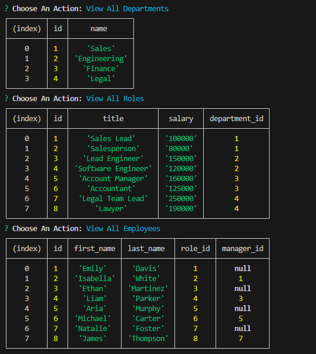

# employee-tracker-app

## Motivation

- The Employee Tracker application is designed to simplify the management of departments, roles, and employees for business owners. The primary motivation is to provide an efficient and user-friendly command-line interface for organizing and planning business operations.

## Purpose

- The purpose of the Employee Tracker application is to streamline the management of key business elements—departments, roles, and employees. Through a command-line interface, the application aims to facilitate easy viewing, addition, and updating of information, contributing to a well-organized and planned business environment.

## Problems

- The problems this app aims to satisfy is that it automates processes to alleviate the burden of manual data management, presents formatted tables for quick and comprehensible access to department names, role details, and employee records. This app also simplifies the data entry process with prompts for adding new departments, roles, and employees, ensuring accurate and efficient database updates.

## Learnings

- The development of the Employee Tracker application provides insights into enhanceing proficiency in handling user input and creating an interactive user experience, improves understanding of database operations, including querying, inserting, and updating records as well as utilizes the Inquirer package for creating dynamic and user-friendly prompts, contributing to a more intuitive application.

## Screenshot

## Links
[Video URL](https://drive.google.com/file/d/1Fxz_FPa8BXkwVE4VPvSmlpez5bdxQU1E/view?usp=sharing)